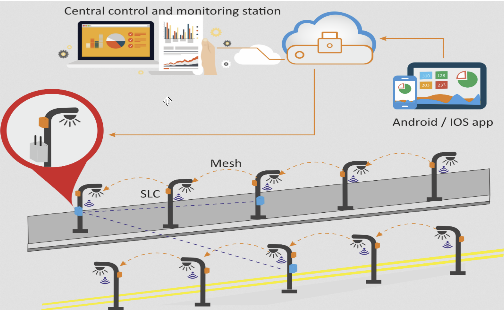

# IT-Technik

## Klassenmitschrift IF11C IT-TEC11

## 4.10.2021

### **Wie realisieren wir die Torüberwachung des AHN?**

Sensoren → 4x Türschließ-Sensor→ Öffner\
Alternative zu Raspberry Pi: Rock Pi, ESP32, Arduino, SPS, PLC\
Lokale DB: MariaDB, Xampp, → 5 Datensätze mit TimeStamp\
Cloudbasierte DB: (DBaaS) Cosmos-DB, AWS MongoDB (NoSQL)\
Benutzerfreundliche Darstellung / Abrufbarkeit:\
App, LED, Kontrollleuchte, Dashboard Node Red, …\
Protokolle: TCP/IP, MQTT, OPCUA, ….\

### **Unterschied Lastenheft - Pflichtenheft:**

Lastenheft: Anforderungen des Auftraggebers (Wünsche und Ziele; meist laienenhaft formuliert)\
Pflichtenheft: Umsetzung der Auftragnehmers, die an den Auftraggeber zurückgeschickt wird (technische Umsetzung wird angegeben)

### **Kriterien für ein Cyberphysisches System (min. 6 Stück)**

- Teilsysteme:  Kombination aus Softwaretechnischen und mechanischen Komponenten
- Autonom: Teilsystem muss auch funktionieren, keine Kommunikation untereinander möglich.  Eingriff über HMI muss möglich sein!
- Abstimmung der vernetzten Komponenten (Datenbanken SAP, Teilsysteme, HMI, Leitstand, ...) Software mit fertigen Schnittstellen,Middleware-Software → OPC Router
- Benötigter Datenaustausch erfolgt untereinander, Teilkomponenten kommunizieren untereinander
- Cybersecurity
- Daten eines cyberphysischen Systems müssen abgespeichert werden
- Informations- und Softwaretechnische Komponenten werden mit mechanischen verbunden. Datentransfer/-austausch findet über ein Netzwerk (z.B. das Internet) in Echtzeit statt
- Graphische Benutzeroberfläche

### **Beispiel für CP-Teilsysteme (Smart City Light Barcelona)**

Ein sehr gutes Beispiel, dass Teilsysteme untereinander kommunizieren!

## 08.10.2021

Heizanlage

Tor-Motorik einfach

Tor-Motorik erweitert

## 12.10.2021

### **Robustheit**

Funktionalit muss nach Stromausfall / Fehlerhafter Bedienung / Temp.-Schwankungen auch gegeben sein

### **Härtung**

allgemeine IT-Sicherheit für das System (z. B. Updates müssen regelmäßig gemacht werden)

### **Besonderheiten/Unterschiede zwischen Linux und Windows**

- Open Source
- Alles ist eine Datei (Befehle, Ordner, etc.)
- Alles kann automatisiert werden (z.B. mit Cron)
- case-sensitive
- Multi-User-Betriebssystem (mehrere Desktops)
- root-User
- Arbeiten in der Shell
- sudo (Befehl, um den darauf folgenden Befehl als Admin auszuführen)
- Hardware wird auch als Dateien abgelegt
