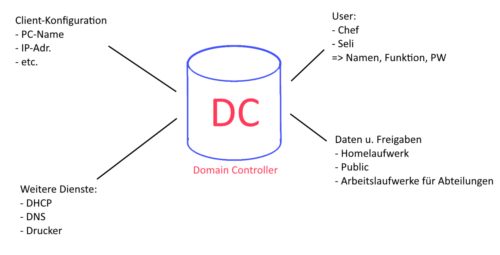

# IF11C - ITS11 - 2021/2022

## sponsored by [noris network AG](https://www.noris.de/)

## Gemeinsames Notizbuch

Dies ist die gemeinsame Notiz- und Arbeitsseite der Klasse IF11C. Diese Seite ist über das Internet frei zugänglich, und das mit Vollzugriff.
Jeder kann jederzeit die Informationen lesen, editieren oder löschen. Bitte verwenden Sie keine persönlichen Informationen (Namen etc.).

---

### Vorteile Client-Server-Systeme

Hauptvorteile:

- Zentrale Datenablage- u. Sicherung
- Zentrale Benutzerverwaltung
- Serverbasierte Dienste u. Anwendungen,
  wie z.B. Druckdienst, Maildienst, DHCP,
  Distribution von Installationspaketen, etc.
- Richtlinien- u. Zugriffssteuerung
  (z.B. via Gruppenrichtlinien)

Diese Vorteile führen zu weiteren positiven Merkmalen:

- Bessere Zugriffssicherheit
- Einfachere Administration u. Wartung
- Gut skalierbar (Stabile Struktur)

---

### Fragen an den Kunden

- Wie viele PC's?
  - Eigentlich 32
  - -> 8 Clients
- Brauchen Sie einen Exchange Server?
  - Wird nicht benötigt (extern)
- Welche Art von PC's (Tower, Workstation, Thin Client)?
  - Desktop-PCs (Tower)
- Welche Benutzerrollen werden benötigt? (AD)
  - Detailiertes Rechtekonzept
- Budget?
  - Erstmal irrelevant
- Redundanz?
  - Erstmal irrelevant
  - Theoretisch durch replizieren denkbar
- Komplexität des Netzwerks?
  - Einfaches Netzwerk
- Laufwerkkonzept
  - Benötigt, Erklärung folgt
- Soll ein Netzwerkspeicher bereitgestellt werden?
  - Wird benötigt, läuft auf haupt Server
- Homeoffice benötigt? (VPN-Verbindung
  - Wird nicht benötigt
- Gebäudeplan?
  - Denkbar
- Terminal Server(?)
  - kein Terminalserver
- Intranet/Website auf dem Server?
  - Nicht Benötigt
- vor Ort oder als Cloud-Lösung
  - Vor Ort
- WLAN? - APs
  - Folgt später
- Nur im internen Netz erreichbar?
  - ?
- Physische Clients oder virtuelle Computer?
  - VMs
- WINDOWS LINUX MACOS?
  - Windows

---

### Gruppen Labor Herbst

| Gruppe | Mitglieder          | Netzadresse |
| :----: | ------------------- | ----------- |
|   1   | Aris                |             |
|       | Sebo der Boss       |             |
|       | Alwinci             |             |
|   2   | Tea                 |             |
|       | Rita                |             |
|       | Hoang               |             |
|   3   | Bayer, Nico         | X.X.X.X     |
|       | Hingelbaum, Florian | X.X.X.X     |
|       | Tränkler, Benjamin | X.X.X.X     |
|   4   | Bühner, Lukas      | x.x.x.x     |
|       | Nguyen, Max         | x.x.x.x     |
|   5   | Maria               | x.x.x.x     |
|       | Kai                 | x.x.x.x     |

---

### Gruppen Labor Graf

| Gruppe | Mitglieder       | Netzadresse  | Inventarnummer |
| :----: | ---------------- | ------------ | -------------- |
|   1   | Tobias Mayer     | 192.162.1.16 | 00054575       |
|       | Viet Nguyen      | 192.162.1.18 | 00054580       |
|       | Michael Heidler  | 192.162.1.14 | 00054594       |
|   2   | Sandra           | 192.168.2.22 | 00054572       |
|       | Lijon            | 192.168.2.29 | 00054581       |
|   3   | Moritz v d Grün | 192.168.3.4  | 00054586       |
|       | Julian Vogl      | 192.168.3.6  | 00054589       |
|       | Alisa Dinkel     | 192.168.3.2  | 00054583       |
|   4   | Alexander B      | 192.168.4.30 | 00054587       |
|       | Philip T         | 192.168.4.32 | 00054596       |
|       | Tobias W         | 192.168.4.26 | 00054585       |
|   5   | Felix            | 192.168.5.12 | 00054588       |
|       | Dominik          | 192.168.5.13 | 00054584       |
|       | Josiah           | 192.168.5.8  | 00054591       |
