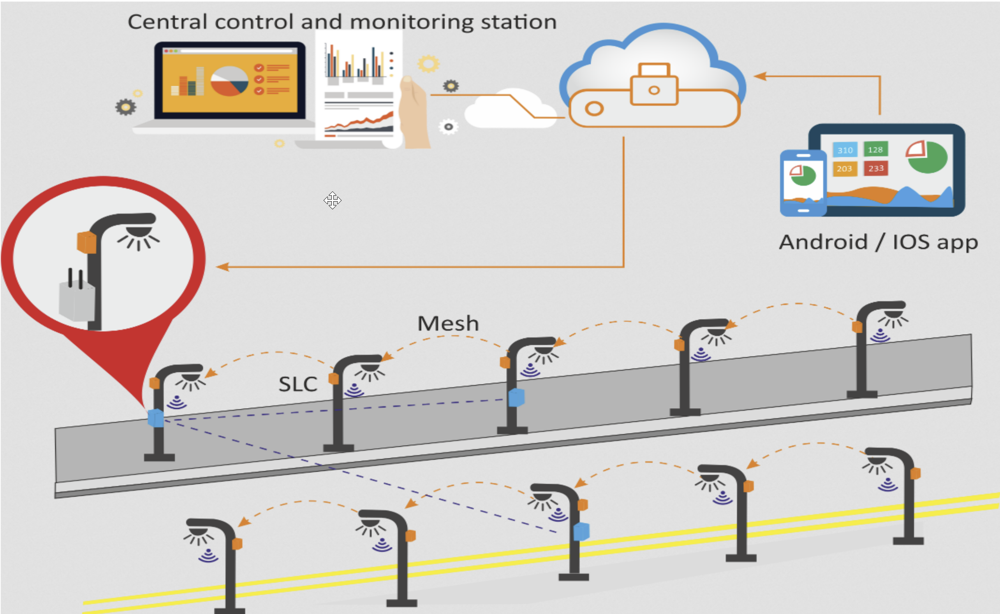

# IT-Technik

- [IT-Technik](#it-technik)
  - [Klassenmitschrift IF11C IT-TEC11](#klassenmitschrift-if11c-it-tec11)
  - [4.10.2021](#4102021)
    - [**Wie realisieren wir die Torüberwachung des AHN?**](#wie-realisieren-wir-die-torüberwachung-des-ahn)
    - [**Unterschied Lastenheft - Pflichtenheft:**](#unterschied-lastenheft---pflichtenheft)
    - [**Kriterien für ein Cyberphysisches System (min. 6 Stück)**](#kriterien-für-ein-cyberphysisches-system-min-6-stück)
    - [**Beispiel für CP-Teilsysteme (Smart City Light Barcelona)**](#beispiel-für-cp-teilsysteme-smart-city-light-barcelona)
  - [08.10.2021](#08102021)
  - [12.10.2021](#12102021)
    - [**Robustheit**](#robustheit)
    - [**Härtung**](#härtung)
    - [**Besonderheiten/Unterschiede zwischen Linux und Windows**](#besonderheitenunterschiede-zwischen-linux-und-windows)
  - [Linux für dummies](#linux-für-dummies)

## Klassenmitschrift IF11C IT-TEC11

## 4.10.2021

### **Wie realisieren wir die Torüberwachung des AHN?**

Sensoren → 4x Türschließ-Sensor→ Öffner\
Alternative zu Raspberry Pi: Rock Pi, ESP32, Arduino, SPS, PLC\
Lokale DB: MariaDB, Xampp, → 5 Datensätze mit TimeStamp\
Cloudbasierte DB: (DBaaS) Cosmos-DB, AWS MongoDB (NoSQL)\
Benutzerfreundliche Darstellung / Abrufbarkeit:\
App, LED, Kontrollleuchte, Dashboard Node Red, …\
Protokolle: TCP/IP, MQTT, OPCUA, ….\

### **Unterschied Lastenheft - Pflichtenheft:**

Lastenheft: Anforderungen des Auftraggebers (Wünsche und Ziele; meist laienenhaft formuliert)\
Pflichtenheft: Umsetzung der Auftragnehmers, die an den Auftraggeber zurückgeschickt wird (technische Umsetzung wird angegeben)

### **Kriterien für ein Cyberphysisches System (min. 6 Stück)**

- Teilsysteme:  Kombination aus Softwaretechnischen und mechanischen Komponenten
- Autonom: Teilsystem muss auch funktionieren, keine Kommunikation untereinander möglich.  Eingriff über HMI muss möglich sein!
- Abstimmung der vernetzten Komponenten (Datenbanken SAP, Teilsysteme, HMI, Leitstand, ...) Software mit fertigen Schnittstellen,Middleware-Software → OPC Router
- Benötigter Datenaustausch erfolgt untereinander, Teilkomponenten kommunizieren untereinander
- Cybersecurity
- Daten eines cyberphysischen Systems müssen abgespeichert werden
- Informations- und Softwaretechnische Komponenten werden mit mechanischen verbunden. Datentransfer/-austausch findet über ein Netzwerk (z.B. das Internet) in Echtzeit statt
- Graphische Benutzeroberfläche

### **Beispiel für CP-Teilsysteme (Smart City Light Barcelona)**

Ein sehr gutes Beispiel, dass Teilsysteme untereinander kommunizieren!

## 08.10.2021

Heizanlage

Tor-Motorik einfach

Tor-Motorik erweitert

## 12.10.2021

### **Robustheit**

Funktionalit muss nach Stromausfall / Fehlerhafter Bedienung / Temp.-Schwankungen auch gegeben sein

### **Härtung**

allgemeine IT-Sicherheit für das System (z. B. Updates müssen regelmäßig gemacht werden)

### **Besonderheiten/Unterschiede zwischen Linux und Windows**

- Open Source
- Alles ist eine Datei (Befehle, Ordner, etc.)
- Alles kann automatisiert werden (z.B. mit Cron)
- case-sensitive
- Multi-User-Betriebssystem (mehrere Desktops)
- root-User
- Arbeiten in der Shell
- sudo (Befehl, um den darauf folgenden Befehl als Admin auszuführen)
- Hardware wird auch als Dateien abgelegt

## Linux für dummies

[Dieses Arbeitsblatt](./resources/120_AB_Unix-Grundbefehle_SuS.pdf)

1. Welche Benutzer sind auf dem System angemeldet?\
   last
2. Mit welcher Kennung sind sie angemeldet?
  whoami
3. An welchem Verzeichnispfad befinden Sie sich gerad?
  pwd
4. Lassen Sie sich den Inhalt des aktuellen Verzeichnisses anzeigen!\
  ls
5. Erstellen Sie das Unterverzeichnis cpsim aktuellen Verzeichnis und überprüfen Sie,ob dies erstellt wurde\
  mkdir cps/
6. Welche Unterverzeichnisse gib es in /Documents?\
   ls
7. Erstellen Sie im Verzeichnis /Documents/cpseine Datei namens b3.txtmit dem Inhalt „Hallo Welt!“\

| variante 1 | variante 2 |
| --- | ---|
| touch b3.txt   vi b3.txt   ESC i   Hallo Welt!   ESC :wq | Cat > b3.txt   Hallo Welt!   Eingabe CTRL+C |
1. Benennen Sie die Datei b3.txtin les.txt um:\
   mv b3.txt les.txt
2. Erstellen Sie eine Kopie der Datei les.txtund benennen Sie diese les-kopie.txt\
    cp les.txt les-lopie.txt
3.  Wie müssen Sie den Befehl anpassen, wenn die Kopie les-kopie.txtim übergeordneten Ordner kopiert werden soll?\
    cp lex.txt ../les-kopie.txt
