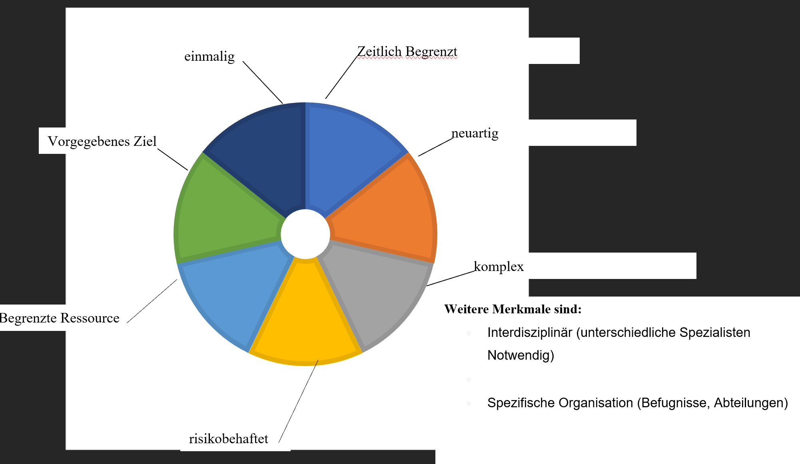

# PlusD - **Projektmanagement**

## 1 Was ist ein Projekt

### 1.1 [Grundlagen](./1.%20Grundlagen/1.1.%20Grundlagen_S.pdf)

#### 1.1.1 Was ist ein Projekt?

**Grundbegriffe des Projektmanagements**
Alle  größeren  Veränderungs-bzw.  Entwicklungsvorhaben  in  Unternehmen  finden  fast  ausschließlich  über Projekte statt. Herkömmliche Arbeitsmethoden sind weniger gut geeignet, die wachsende Dynamik, die große Anzahl von Einflussfaktoren undderen Vernetzung zu erfassen und die damit verbundenen Fragestellungen angemessen zu lösen. Die folgenden drei Veränderungen sprechen für die Projektarbeit:

- **Technischer Fortschritt und Zeitdruck:**
  Die Innovationszyklen werden immer kürzer. Man kann nicht einfach abwarten und zuschauen, was die anderen machen. Eine solche Haltung würde in vielen Fällen bereits einen Wettbewerbsnachteil zur Folge haben. Dies erzeugt einen ungewünschten Zeitdruck.
- **Steigende Komplexität:**
  Viele  reale  Situationen  werden  immer  komplexer.  Die  Menge  an  Vorschriften  und  Gesetzen,  die  bei Gestaltungsaufgaben beachtet werden müssen, nimmt permanent zu. Zudem kann man heute selten nur noch mit Blick auf das eigene Unternehmen Veränderungen vornehmen, da die Globalisierung der Märkte, die  Konzentration  der  Unternehmen  zu  immer  größeren  Konzernen  zunehmend  eine  ganzheitliche Denkweise erfordern.
- **Das notwendige Wissen nimmt zu:**
  Das  notwendige  Wissen  zur  Anwendung  der  zur  Verfügung  stehenden  Technologien  wird  immer anspruchsvoller, sodass vermehrt Spezialisten in den einzelnen Veränderungsaufgaben eingesetzt werden müssen.  Dies  führt  dazu,  dass  man  zur  Bewältigung  von  Aufgaben  immer  mehr  Personen  benötigt  und schon aus diesem Grund vermehrt auf Teamarbeit setzen muss.

Auch  die  Projektarbeit  erfordert  einen  organisatorischen  Rahmen,  in  dem  sie  geregelt  ablaufen  kann. Allerdings sind die Grenzen fließend zwischen Aufgaben, die als spezielle Projektarbeit gelten, und solchen, die zur „normalen“ Arbeit gehören.  Häufig  wird  anhand  von  firmeninternen  Kriterien  entschieden,  ob  ein Vorhaben als Projekt abzuwickeln is

*Definition nach **DIN 69900 + 69901***:
Ein Projekt ist ein Vorgehen, das in im Wesentlichen durch Einmaligkeit der Bedingung in ihrer Gesamtheit Gekennzeichnet ist.\
Es zeichnet sich aus durch:

- eine Zielvorgabe
- zeitliche, finanzielle, personelle oder andere Begrenzungen
- projektspezifisch Organisation

#### 1.1.2 Projektmerkmale

Aufgrund der sehr offenen Definition eines Projektes hat man begonnen Projekte durch spezifische Merkmale zu definieren. Die wichtigsten sieben Merkmale werden im Folgenden näher erklärt.

1. Projekte zeichnen sich dadurch aus, dass sie ein *vorgegebenes Ziel* haben. Es liegt eine Problemstellung vor, die gelöst werden soll.
2. Projekte umfassen zumeist Aufgaben, die in dieser Form noch nicht durchgeführt wurden und sind daher *neuartig*.
3. Projekte werden in der Regel nur *einmal* durchgeführt. Dazu im Gegensatz stehen Routineaufgaben, die in  festgeschriebenen  zeitlichen  Abständen  wiederholt  stattfinden.  Die  spezifischen  Bedingungen,  die Ausgangslage und die Zielsetzung des Projekts sind *einmalig*, d.h. sie waren genau in diesem Setting noch nicht in anderen Projekten vorhanden.
4. Projekte sind mehr oder weniger *komplex*, sodass einige Schritte im Projektverlauf häufig zu Beginn nicht gleich klar sind. Unter Berücksichtigung  vorhandener  Gegebenheiten müssenvor  dem Projektstart eine Vielzahl  von  Teilaufgaben  und  Problemstellungen  durchdacht  und  koordiniert  werden.  Viele  Faktoren, die untereinander in einer Wechselbeziehung stehen, müssen gleichzeitig berücksichtigt werden.
5. Projekte sind *zeitlich begrenzte Vorhaben*, die einen festen Anfangs-und/oder Endpunkt haben.
6. Projekte sind auf den Einsatz von *Ressourcen* angewiesen, die in der Regel nur in *begrenztem Maße* zur Verfügung  stehen  wie  z.B.  Projektmitarbeiter,  finanzielle  Ressourcen  (Projektbudget)  und  technische Ressourcen (Maschinen und Material).
7. Da   in   irgendeiner   Form   Neuland   betreten   wird,   kann   man   sich   nicht   in   allen   Situationen   auf Erfahrungswerte stützen, sodass je nach Komplexität eines Projektes verschiedene Aktivitäten nur schwer planbar sind oder sich während der Projektlaufzeit verändern. Somit birgt ein Projekt auch immer *Risiken und Unsicherheite*

Zusammenfassend:
Eine (Entwicklungs-) Tätifgkeit (auch Beschaffungs-, Bau oder Organisationstätigkeit), die

- Klar definiert und abgegrenzt ist
- Einmalig ist und sich in dieser form nicht mehr wiederhohlt
- Lösbar sein muss
- Innovativ und/oder risikoreich ist
- Sich zeitlich abgrenzen lässt (Anfangs- und Endtermin)
- Sich kostenmäßig brechnen oder abschätzen lässt
- Sich auf Grund der Komplexität nicht durch bereits vorhandene Betriebsinstanzen lösen lässt
- Mit anderen Tätigkeiten und Bereichen um begrenzte Ressourcen konkurrieren
nennt man "Projekt"

#### 1.1.3 Projektarten

[(komplett nur PDF)](./1.%20Grundlagen/1.1.%20Grundlagen_S.pdf)

#### 1.1.4 IT-Projekte

1. nach Art
   - Entwicklungsprojekte (Strategie-oder Innovationsprojekte sowie Eigenentwicklungen) 
   - Sanierungs-/Wartungsprojekte 
   - Migrations-Integrationsprojekte
   - Einführungsprojekte
   - Upgrade-Projekte
   - Erstinbetriebnahme
   - Schulungsprojekte
2. nach Grösse
   - Kleinprojekte
   - Mittelgrosse Projekte
   - Grossprojekte
3. nach Anwendungsgebiet
   - Enterprise Resource Planning-Projekte (ERP-Projekte)
   - E-Business-/Web-Projekt
   - Multimediaprojekte
   - Rechenzentren-Projekte
   - Bürostandort neu Aufbauen
   - Cloud-Projekte

#### 1.1.5 Abschlussprojekt in der IT-Ausbildung

(wird erstmal übersprungen)

#### 1.1.6 Projektmanagement

Vorgehensweisen in der IT:

- Wasserfallmodell (siehe Text)
- V-Modell (Wasserfall + QA)
- SCRUM
- Kanban
- Extreme Programming (XP)
- Spiralmodell
- Prototyping

---
